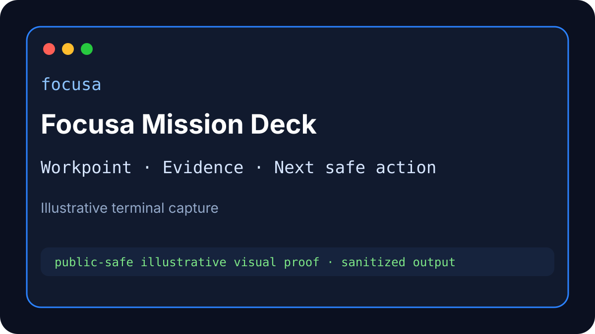

<p align="center">
  
</p>

<h1 align="center">Focusa</h1>

<p align="center">
  <strong>Keep AI coding agents on mission.</strong><br>
  <sub>Local-first proof, Workpoints, Evidence, and continuation for long-running coding agents.</sub>
</p>

<p align="center">
  <a href="https://github.com/Startempire-Wire/focusa/actions/workflows/ci.yml"></a>
  <a href="https://github.com/Startempire-Wire/focusa/actions/workflows/release.yml"></a>
  
  
  
  
</p>

Focusa is the local-first proof and continuity layer for AI coding agents. Current source version: `v0.9.152`.

> **Evaluator/customer distribution status:** Focusa's lifecycle, release, Workpoint, Evidence, Pi, TUI, and Mission Canvas foundations are advanced, but mandatory authority-issued licensing is not yet implemented end to end. The current Bash/PowerShell `--eval` path self-issues local Evaluation and is now release-blocked. New evaluator/customer installs must wait for Spec 152, Spec 150A, and applicable Spec 152A proof rather than using that legacy bypass.

When a coding session gets long, context compacts, the mission drifts, proof gets buried, or another agent takes over, Focusa preserves work as a proof-backed **Workpoint** with linked **Evidence** and a **next safe action**. The next agent should not have to guess from transcript memory.

## Current architecture

- **Exact scope and worktrees:** authority is `project_root + continuity_id`; worktrees are verified working subpaths, not accidental new projects.
- **Daemon-native Silent Sessions:** durable background runs support observation, steering, pause/resume/restart, approvals, idempotency, and receipts.
- **Governed work loop and recovery:** one writer, canonical checkpoints, proactive compaction, cache-safe context, and governed rollover.
- **Mission Canvas and Work Rail:** scoped Work Surfaces, interviews, workspace artifacts, UIAI browser context, connectors, software/domain projections, and adaptive generated UI.
- **Customer lifecycle mechanics:** typed install/repair/update/rollback/uninstall transactions with data preservation and proof; uninstall with user data preserved by default, purge explicit.
- **Agent-ready contracts:** every Focusa Pi tool has runtime, generated machine, documentation, skill, and runbook projections.
- **Mandatory licensing target:** authority-issued signed Evaluation/paid/developer leases, recovery-only missing state, product-qualified features/limits, UIAI independent grants, and protected private workers/capsules for selected commercial functionality.

Trajectory ladder: **HLT** → **MLG** → **STG** → **Waypoints**. Workpoint remains immediate action authority. The operator has authority; agents may propose trajectory-aligned work without silently changing the root goal.

## Install and lifecycle status

### Approved current operations

Until mandatory entitlement implementation lands, public guidance is limited to non-mutating inspection and data-preserving removal:

```bash
# Inspect platform, dependencies, current install, and release/update posture.
# This does not create Evaluation and must not activate runnable product components.
focusa install --preflight --json
focusa update status --json
focusa update plan --json

# Remove managed software while preserving user data.
curl -fsS https://install.focusa.dev/focusa | bash -s -- --uninstall
```

Do not use or recommend:

```text
scripts/install-focusa.sh --eval
install-focusa.ps1 -Eval
curl ... | bash -s -- --eval
```

Those are current-code migration surfaces, not approved evaluator onboarding.

### Required target onboarding

```text
verify official release
→ choose Evaluate / Activate / Purchase
→ authority device code
→ verified account/email and current terms
→ separate promotional-email choice
→ authority-issued signed product lease
→ node/features/limits verification
→ atomic install and recovery/entitled daemon status
→ optional UIAI independent product grant and child token
→ pairing
→ optional first project and Workpoint
```

Target CLI examples such as `focusa license start --product bundle` are normative in Spec 152 but must not be treated as shipped until implementation and release proof exist.

### Source development

The repository is source-available under BSL 1.1. A source checkout is not an authority-issued Evaluation and does not include protected private components.

Maintainer/development build example:

```bash
git clone https://github.com/Startempire-Wire/focusa.git
cd focusa
cargo build -p focusa-cli -p focusa-api
cargo test -p focusa-license
```

Developer access to production/private workers, capsules, channels, or signing systems requires a separate authority-issued developer license and private-repository authorization. Repository access or environment variables never create production entitlement.

## Continuity proof model

Once an entitled or authorized development runtime is available, the core continuity flow is:

```text
project identity
→ Trajectory
→ Workpoint checkpoint/resume
→ Evidence linkage
→ safe next action
```

Representative commands:

```bash
focusa project discover --max-depth 2 --json
focusa first-mission --project-root "$PWD" --dry-run --json
focusa workpoint checkpoint \
  --project-root "$PWD" \
  --continuity-id demo-continuity \
  --mission "First Focusa proof" \
  --next-action "Resume from the Workpoint packet" \
  --json
focusa workpoint evidence-link \
  --target-ref tests \
  --result "focused test passed" \
  --evidence-ref "test:focused" \
  --json
focusa workpoint resume \
  --project-root "$PWD" \
  --continuity-id demo-continuity \
  --copy-prompt
```

The final implementation must deny mutation before these commands produce side effects when the canonical lease/product/feature/time/node/limit gate fails. Recovery-safe inspection remains available.

## Core product surfaces

### Workpoints and Evidence

A Workpoint is a typed continuation contract containing mission, scope, current/next action, blockers, and proof handles. Evidence links tests, files, routes, screenshots, command output, and release checks to that Workpoint.

### Context Authority

Before risky changes, Focusa checks whether the task, project, environment, and install role match the operator's intent. Entitlement Authority is separate: context alignment cannot override a missing product or feature grant.

### Mission Deck and TUI

```bash
focusa deck --headless-self-test --json
focusa tui --headless-self-test --json
```

### Pi integration

The Pi extension lets agents call Focusa's Workpoint, Evidence, trajectory, recovery, prediction, metacognition, and lifecycle surfaces without inventing a parallel memory system. Future generated descriptors must expose product-qualified `license_feature` and optional limit metadata for execution-capable tools.

v0.9.142 route: `focusa_project_identity → focusa_trajectory_view → focusa_workpoint_resume → focusa_evidence_capture → focusa_predict_evaluate`; checkpoint with `focusa_workpoint_checkpoint` before compaction or risky continuation.

### Local daemon and typed API

Focusa runs beside agents as a Rust daemon. State stays on the operator's machine or VPS. The final licensing architecture allows the daemon to start without a valid lease only in recovery mode.

### Menubar preview

The macOS/Tauri menubar remains a preview surface. The required first-run order is entitlement → optional UIAI grant → pairing → project/Workpoint, not pairing as a license substitute.

### UIAI Engine

UIAI Engine is an optional proof-browser/execution plane. Health, loopback, a local API token, extension token, or Focusa pairing never grants UIAI entitlement. UIAI independently verifies its product/features/limits or a scoped child token derived from a valid parent bundle lease.

### Protected distribution

Selected commercially valuable Focusa/UIAI implementations may move to private, signed workers or encrypted feature capsules. Patching a public license Boolean must not create the missing worker, node-bound key envelope, operation capability, or official protected update.

## Agent-first capability discovery

Focusa publishes generated capability descriptors across Pi, MCP, OpenAI-compatible functions, CLI JSON help, REST, skills, and browser workflows. Agents progressively load only what the next action needs:

1. `focusa_agent_card`
2. `focusa_tool_search`
3. `focusa_tool_describe`
4. `focusa_tool_graph`
5. `focusa_tool_bundle`

All 135 Focusa Pi tools are documented across the machine contracts, Agent Card, per-tool docs, and 29 generated skills. Machine contracts: [`docs/contracts/spec141/generated-capability-v2/`](docs/contracts/spec141/generated-capability-v2/)

Every Pi tool: [`docs/focusa-tools/tools/`](docs/focusa-tools/tools/)  
Skills/runbooks: [`.pi/skills/`](.pi/skills/)  
Agent fast start: [`docs/agent/01-focusa-agent-docs-index.md`](docs/agent/01-focusa-agent-docs-index.md)

## Core read-only and recovery-safe discovery

```bash
focusa help all
focusa help migration
focusa project
focusa setup wizard --dry-run
focusa first-mission --project-root "$PWD" --dry-run --json
focusa status operator --json
focusa update --help
focusa tui --headless-self-test
focusa cleanup --safe --project-root "$PWD" --dry-run --json
```

Current commands do not yet all share the final canonical entitlement gate. Do not interpret command availability as product permission.

## Proof and CI

Existing product/lifecycle proof:

```bash
cargo test -p focusa-cli
cargo test -p focusa-api
cargo test -p focusa-core persistence_sqlite
bash tests/spec_cli_cross_phase_smoke_test.sh
```

Mandatory licensing/documentation proof adds:

```bash
python3 tests/spec152_documentation_consistency_gate.py
```

Final distribution additionally requires signed-lease golden vectors, authority staging E2E, lifecycle entitlement receipts, UIAI endpoint-feature coverage, installer Bash/PowerShell parity, fixture exclusion, redaction, and protected-component adversarial proof where applicable.

## Documentation

### Mandatory licensing and lifecycle authority

- [Spec 152 — authority-issued licensing, Evaluation, and unified onboarding](docs/152-mandatory-authority-licensing-evaluation-entitlements-and-unified-onboarding-spec.md)
- [Spec 150A — entitlement overlay for verified lifecycle contracts](docs/150a-spec152-entitlement-overlay-and-lifecycle-integration.md)
- [Spec 152A — protected distribution and anti-tamper](docs/152a-protected-distribution-private-feature-capsules-and-anti-tamper-spec.md)
- [Supersession and contradiction matrix](docs/contracts/spec152-supersession-and-integration-matrix.v1.yaml)
- [Current first-run flow](docs/current/FIRST_RUN_FLOW.md)
- [Current installer/update policy](docs/current/INSTALLER_UPDATE_POLICY.md)
- [Commercial packaging](docs/current/COMMERCIAL_PACKAGING.md)

### Product and agent docs

- [Current CLI reference](docs/current/CLI_REFERENCE_CURRENT.md)
- [Troubleshooting](docs/current/TROUBLESHOOTING_CURRENT.md)
- [Agent architecture and discovery](docs/agent/01-focusa-agent-docs-index.md)
- [Tool Implementation-to-Spec Audit](docs/current/FOCUSA_TOOL_IMPLEMENTATION_SPEC_AUDIT.md)
- [Model-Visible Awareness Surfaces](docs/current/FOCUSA_MODEL_VISIBLE_AWARENESS.md)
- [Non-Pi Agent Focusa Usage](docs/current/NON_PI_AGENT_FOCUSA_USAGE.md)
- [Friendly Focusa Onboarding Q](docs/current/FOCUSA_FRIENDLY_ONBOARDING.md)
- [Agent Awareness Quickstart](docs/current/AGENT_AWARENESS_QUICKSTART.md)
- [Focusa Utility Card](docs/current/FOCUSA_AGENT_UTILITY_CARD.md)
- [Focusa Tool Choreography Map](docs/current/FOCUSA_TOOL_CHOREOGRAPHY_MAP.md)
- [Current Runtime Status](docs/current/CURRENT_RUNTIME_STATUS.md)
- [Mission Canvas/current generated UI](docs/135-series-current-manifest.md)
- [Complete tool documentation](docs/focusa-tools/README.md)
- [Public shipped/planned status](docs/PUBLIC_DOCS_SYNC.md)

## License

Focusa is source-available under the Business Source License 1.1. See [`LICENSE.md`](LICENSE.md). Source-use permission and official product entitlement are distinct boundaries. Evaluation is an authority-issued license class under the target runtime architecture, not absence of a license.
