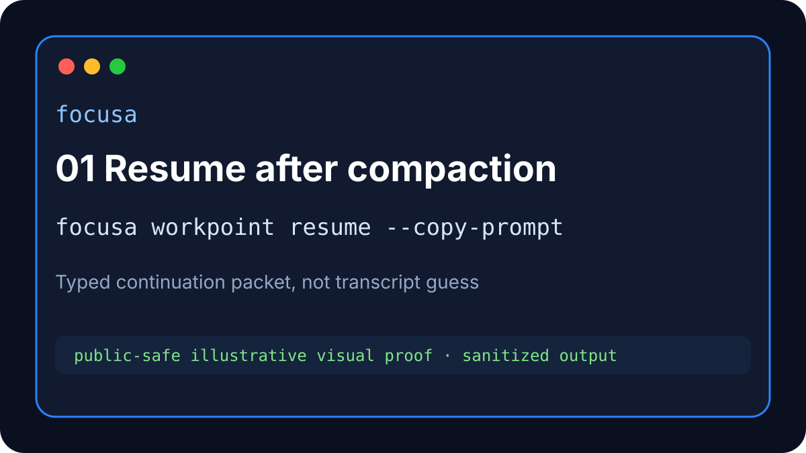
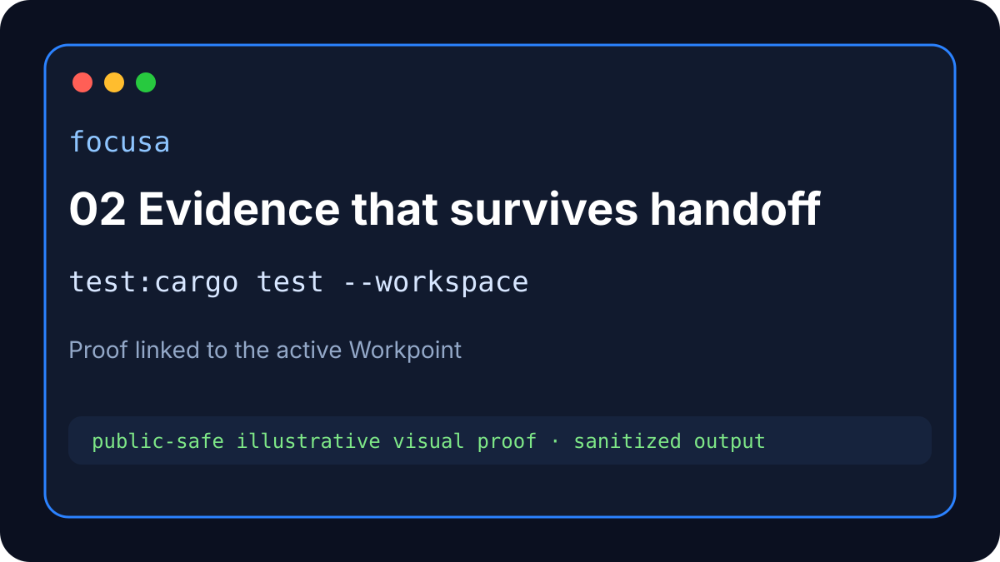
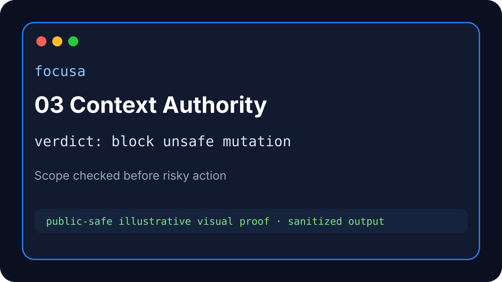
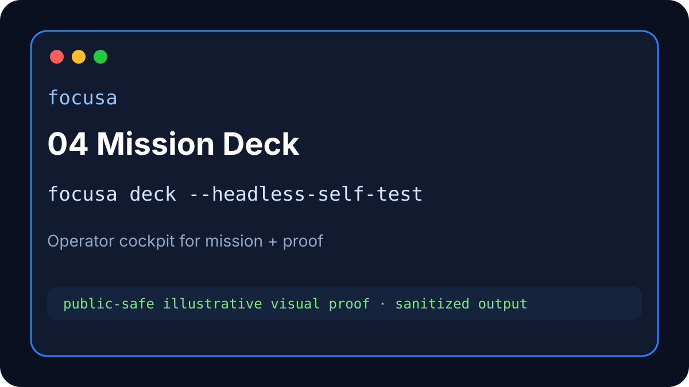
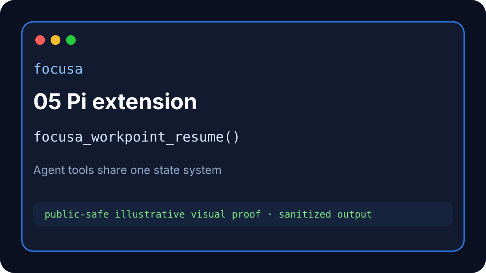
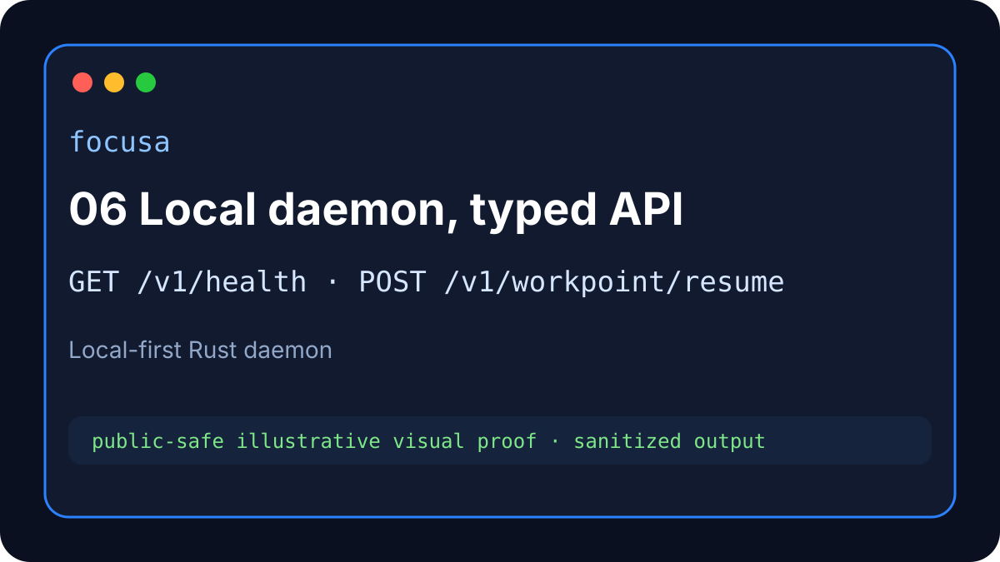
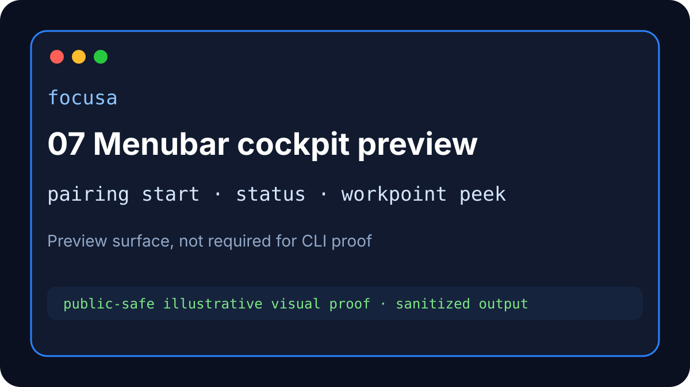
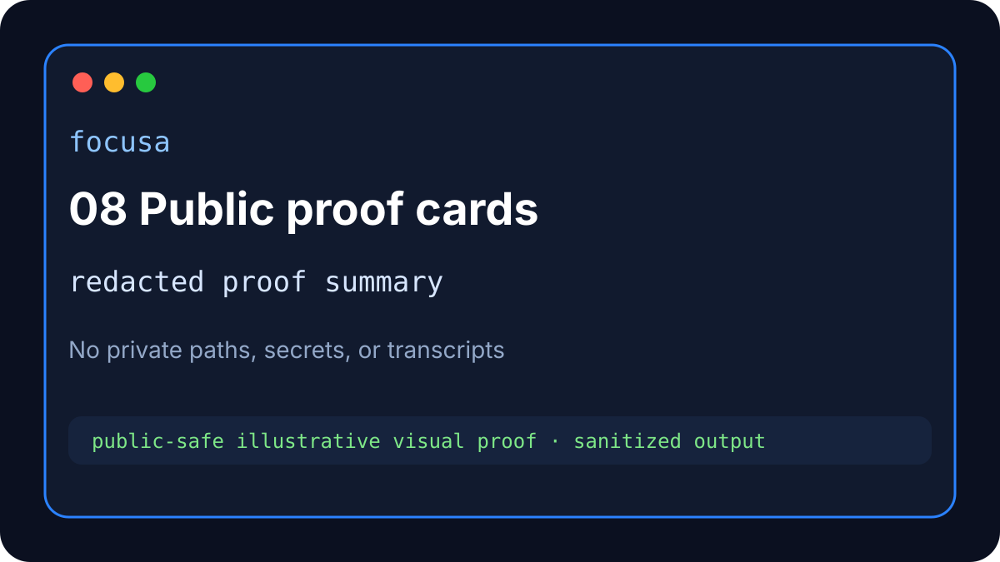

<p align="center">
  
</p>

<h1 align="center">Focusa</h1>

<p align="center">
  <strong>Keep AI coding agents on mission.</strong><br>
  <sub>Local-first proof, Workpoints, Evidence, and continuation for long-running coding agents.</sub>
</p>

<p align="center">
  <a href="https://github.com/Startempire-Wire/focusa/actions/workflows/ci.yml"></a>
  <a href="https://github.com/Startempire-Wire/focusa/actions/workflows/release.yml"></a>
  
  
  
  
</p>

Focusa is the local-first proof and continuity layer for AI coding agents.

When a coding session gets long, context compacts, the mission drifts, proof gets buried, or another agent takes over, Focusa preserves the work as a proof-backed **Workpoint** with linked **Evidence** and a **next safe action**. The next agent should not have to guess from transcript memory.

## Install

[Release Install Postcard](docs/RELEASE_INSTALL_POSTCARD.md) — install, verify health, quickstart, and open Mission Deck.

```bash
curl -fsS https://install.focusa.dev/focusa | bash -s -- --eval
focusa start
focusa setup wizard --dry-run
focusa doctor
```

Safe installer/update checks before changing anything:

```bash
focusa install --preflight --json
focusa update status --json
focusa update plan --json
focusa update apply --yes --allow-apply --dry-run false --json
focusa update scheduler --install --json  # Linux/root: verified two-minute timer
```

These commands report stale CLI/daemon/TUI surfaces, dependency prompts, update policy, rollback/safety gates, and notification routes. `update apply` promotes only checksum + Sigstore signature verified assets using an atomic staged rename and rollback journal; `scheduler --install` enables persistent two-minute verified refresh checks. Neither overwrites `.env`, license, or project data; daemon restart remains separately gated.

Prefer a local build while evaluating from source?

```bash
git clone https://github.com/Startempire-Wire/focusa.git
cd focusa
cargo build -p focusa-cli -p focusa-api
./target/debug/focusa help all
```

## Five-minute proof

Run a non-destructive continuity proof in any project folder:

```bash
focusa project discover --max-depth 2 --json
focusa first-mission --project-root "$PWD" --dry-run --json
focusa workpoint checkpoint \
  --project-root "$PWD" \
  --continuity-id demo-continuity \
  --mission "First Focusa proof" \
  --next-action "Resume from the Workpoint packet" \
  --json
focusa workpoint evidence-link \
  --target-ref tests \
  --result "cargo test -p focusa-cli passed" \
  --evidence-ref "test:cargo test -p focusa-cli" \
  --json
focusa workpoint resume \
  --project-root "$PWD" \
  --continuity-id demo-continuity \
  --copy-prompt
```

Expected result: a typed resume packet with mission, scope, proof handle, and next action. If scope is unsafe or unclear, Focusa returns a blocked envelope instead of pretending the work is canonical.

## The Focusa you can use today

### 01 · Resume after compaction



A Workpoint gives the next agent a typed continuation contract instead of a transcript guess. It carries mission, scope, next action, and proof links.

```bash
focusa workpoint resume --project-root "$PWD" --continuity-id demo-continuity --copy-prompt
```

### 02 · Evidence that survives handoff



Focusa stores proof as Evidence refs tied to the active Workpoint: tests, files, routes, screenshots, command output, and release checks.

```bash
focusa workpoint evidence-link \
  --target-ref crates/focusa-cli \
  --result "CLI smoke passed" \
  --evidence-ref "test:cross_phase_smoke_e2e" \
  --json
```

### 03 · Context Authority stops off-mission mutation



Before risky changes, Focusa checks whether the current task, project, environment, and install role match the operator’s actual intent.

```bash
focusa action preflight \
  --current-ask "install Focusa locally" \
  --kind binary_replace \
  --target /usr/local/bin/focusa \
  --source github_release_asset \
  --install-role live_build_host \
  --project-root "$PWD" \
  --json
```

### 04 · Mission Deck in the terminal



The Mission Deck gives operators a compact cockpit: current focus, Workpoint, proof state, trajectory, health, and next safe action.

```bash
focusa deck --headless-self-test --json
# or
focusa tui --headless-self-test --json
```

### 05 · Pi extension integration



The Pi extension lets agents call Focusa directly, linking Workpoints, Evidence, trajectory, recovery tools, and bounded state without inventing a parallel memory system.

```text
focusa_workpoint_resume → focusa_trajectory_view → focusa_evidence_capture
```

### 06 · Local daemon, typed API



Focusa runs beside the agent as a local Rust daemon. State stays on your machine or VPS. The HTTP API is typed, inspectable, and scriptable.

```bash
curl -fsS http://127.0.0.1:8787/v1/health
focusa status operator --json
focusa help migration
```

### 07 · Menubar cockpit preview



The macOS/Tauri menubar is a preview surface. The primary Operator Preview today is daemon, CLI, TUI, Workpoints, Evidence, and Pi integration.

```bash
focusa pairing start --help
focusa device pair-start --device-name operator-macbook --platform macos
```

### 08 · Public proof, redacted by default



Focusa can produce public-safe proof summaries without exposing local paths, full chat logs, license data, secrets, or personal operator state.

```bash
focusa release prove --tag v0.9.80-dev --fast --json
bash tests/spec_cli_cross_phase_smoke_test.sh
```

## Core commands

```bash
focusa help all
focusa project
focusa setup wizard --dry-run
focusa first-mission --project-root "$PWD" --dry-run --json
focusa status operator --json
focusa workpoint checkpoint --project-root "$PWD" --continuity-id demo --mission "Ship proof" --next-action "Run smoke" --json
focusa workpoint resume --project-root "$PWD" --continuity-id demo --copy-prompt
focusa cleanup --safe --project-root "$PWD" --dry-run --json
```

Migration help is built in:

```bash
focusa help migration
```

Deprecated aliases warn and point to canonical commands; for example, `focusa pair` routes users toward `focusa pairing start`.

## Architecture at a glance

- **`focusa-api`** — local Rust daemon and typed HTTP API.
- **`focusa-cli`** — operator and agent command surface.
- **`focusa-core`** — Workpoints, Evidence, reducers, runtime state, and persistence.
- **`focusa-tui`** — terminal Mission Deck.
- **`apps/pi-extension`** — Pi coding-agent integration.
- **`apps/menubar`** — preview macOS/Tauri cockpit.

## Proof and CI

Focusa’s public proof posture is command-first:

```bash
cargo test -p focusa-cli
cargo test -p focusa-api
cargo test -p focusa-core persistence_sqlite
bash tests/spec_cli_cross_phase_smoke_test.sh
```

The cross-phase smoke suite checks project dashboard commands, first-mission dry run, status aliases, Mission Deck self-test, scope rejection, uninstall keep flags, route parity, and daemon-global mutation blocking.

## Documentation

- Current CLI reference: [`docs/current/CLI_REFERENCE_CURRENT.md`](docs/current/CLI_REFERENCE_CURRENT.md)
- Production/release commands: [`docs/current/PRODUCTION_RELEASE_COMMANDS.md`](docs/current/PRODUCTION_RELEASE_COMMANDS.md)
- Troubleshooting: [`docs/current/TROUBLESHOOTING_CURRENT.md`](docs/current/TROUBLESHOOTING_CURRENT.md)
- Spec-first lifecycle and claim discipline: [`docs/107-spec-first-feature-lifecycle-and-claim-discipline-spec.md`](docs/107-spec-first-feature-lifecycle-and-claim-discipline-spec.md)
- Complete Focusa tool documentation index: [`docs/focusa-tools/README.md`](docs/focusa-tools/README.md)

## License

Focusa is source-available under the Business Source License 1.1. See [`LICENSE`](LICENSE).
