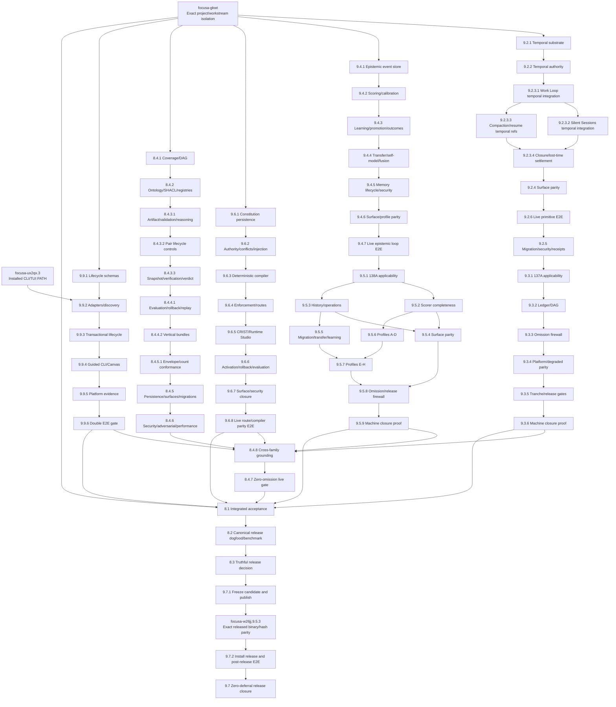
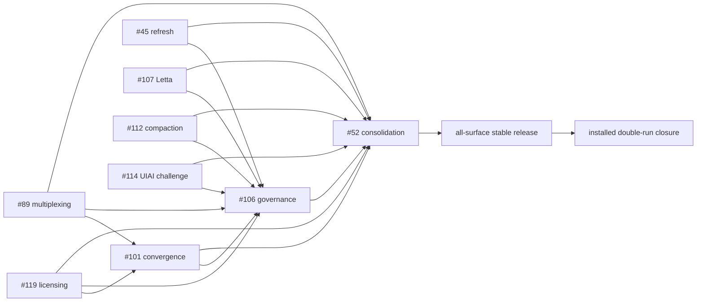

# Focusa Locked Release Repair Task Graph

**Status:** Active P0 repair graph  
**Authority:** Existing Focusa locked-release specifications and Beads  
**Rule:** No completion from schema, registration, static fixtures, or source presence alone. Every terminal branch requires live typed event → reducer → durable projection → replay → evidence across applicable installed surfaces.

## 1. Dependency graph

## 2. Implementation order

### Phase 0 — Trustworthy scope and install baseline

1. `focusa-gkwt` — eliminate foreign trajectory/tool-output contamination; prove two exact-scope runs.
2. `focusa-ux2qx.3` — make installed CLI/TUI path deterministic.
3. Install and verify the current stable CLI/daemon/TUI/installer baseline; keep `focusa-w26jj.9.5.3` open because exact repaired-artifact hashes require the terminal release.

### Phase 1 — Core authority substrates (parallel after Phase 0)

- Temporal: `9.2.1` through `9.2.3`.
- Prediction: `9.4.1` through `9.4.3`.
- Runtime Constitution: `9.6.1` through `9.6.2`.
- Semantic integrity: `8.4.1` through `8.4.2`.
- Install lifecycle: `9.9.1` through `9.9.2`.

### Phase 2 — Complete primitive execution

- Temporal runtime integration: `9.2.3.1` Work Loop → `9.2.3.2` Silent Sessions plus `9.2.3.3` compaction/resume → `9.2.3.4` closure settlement.
- Temporal surfaces and live proof: `9.2.4`, `9.2.6`, `9.2.5`.
- Prediction advanced/lifecycle/surfaces: `9.4.4` through `9.4.7`.
- Runtime compiler/enforcement/studio/lifecycle: `9.6.3` through `9.6.8`.
- Semantic operations: `8.4.3.1` → `8.4.3.2` → `8.4.3.3` → `8.4.4.1` → `8.4.4.2` → `8.4.5.1`.
- Install transaction and UX: `9.9.3` through `9.9.4`.

### Phase 3 — Zero-deferral conformance

- Spec137A: `9.3.1` through `9.3.6`.
- Spec138A: `9.5.1` through `9.5.9`.
- Spec144 persistence/security: `8.4.5` through `8.4.6`.
- Spec150 platform evidence: `9.9.5`.

### Phase 4 — Cross-family integration and double-run proof

1. `8.4.8` — every public tool/family grounded or evidence-backed not applicable.
2. `8.4.7` — zero-omission live-effect gate.
3. `9.9.6` — two clean install/onboarding/maintenance E2E runs.
4. `8.1` — complete exact-SHA integrated acceptance matrix.

### Phase 5 — Canonical release closure

1. `8.2` — canonical candidate dogfood plus speed/friction benchmark.
2. `8.3` — truthful SHIPPED/BLOCKED decision.
3. `9.7.1` — freeze the accepted exact SHA and publish through the canonical release cycle without bypasses.
4. `focusa-w26jj.9.5.3` — install the published artifacts and require exact cross-part versions and hashes.
5. `9.7.2` — run two fresh-process post-release E2E passes and close installed parity.
6. `9.7` — close only after publication and post-release parity both pass.

## 3. Universal done condition

A task is not done unless all applicable items exist:

- typed public input and scope validation
- append-only authority event
- reducer and durable projection
- deterministic replay/conflict behavior
- positive, negative, adversarial, and cross-scope tests
- CLI/API/Pi/TUI/menubar/generated UI parity
- evidence and receipt references
- recovery/rollback path
- exact installed-version proof
- two clean live E2E runs for terminal gates

## 4. Open baseline issue decomposition

All nine open GitHub baseline issues remain open. Their canonical implementation work is decomposed into 74 ordered child tasks under the locked-release root; the separately discovered all-surface release repair adds seven more. Each child has a concrete description, acceptance criterion, parent, and blocking edge to its predecessor.

| GitHub issue | Canonical Bead epic | Children | Primary dependency |
|---|---|---:|---|
| #119 licensing/onboarding | `focusa-vbcqu.10` | 12 | foundational authority lane |
| #45 scoped refresh | `focusa-vbcqu.11` | 9 | isolated Mission Canvas PR only at child `11.6`; post-compaction Pi widget at `11.9` |
| #89 daemon multiplexing | `focusa-vbcqu.12` | 8 | independent runtime lane |
| #101 managed convergence | `focusa-vbcqu.13` | 9 | #89 and #119 |
| #106 release governance | `focusa-vbcqu.14` | 5 | all technical baseline epics |
| #107 Letta adapter | `focusa-vbcqu.15` | 8 | independent adapter lane |
| #112 adaptive compaction | `focusa-vbcqu.16` | 9 | independent controller lane |
| #114 UIAI challenge capability | `focusa-vbcqu.17` | 7 | external UIAI capability contract |
| #52 final consolidation | `focusa-vbcqu.18` | 7 | #45, #89, #101, #106, #107, #112, #114, #119 |
| all-surface release repair | `focusa-vbcqu.19` | 7 | candidate assembly waits for #52 |

### 4.1 Cross-epic order

### 4.2 Ready work versus blocked work

- Ready in parallel: `10.1`, `11.1`, `12.1`, `15.1`, `16.1`, `17.1`, and release artifact contract/Windows preflight work `19.1`–`19.2`.
- `11.9` explicitly owns post-compaction North Star completeness: exact scope authority, coherent state, bounded operation counts/pagination, readable narrow-width rendering, and zero private-context leakage; final #45 acceptance `11.8` depends on it.
- #101 implementation begins only after multiplexing and licensing authority foundations are accepted.
- #106 reconciliation begins only after every technical epic reaches accepted closure.
- #52 is the final baseline consolidation gate and cannot begin terminal acceptance while any upstream epic remains open.
- Release candidate assembly at `19.3` depends on #52; publication never rewrites `v0.9.143`.
- `focusa-vbcqu.8` depends on the release epic and remains the final installed double-run acceptance gate.

Dependency-cycle audit: zero active cycles. Administrative issue closure is not a dependency substitute.
