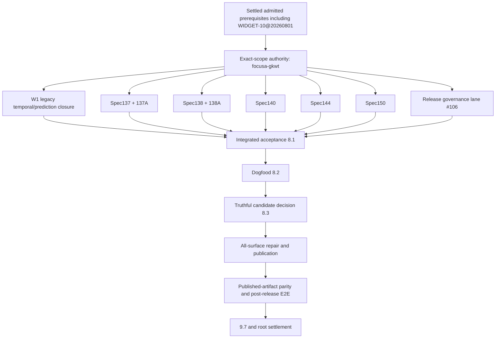

# Spec 156 — Focusa Mangled Release Delta CallGraph Reconstruction

**Status:** Active reconstruction; execution ordering authority; no Spec 155 runtime implementation
**Date:** 2026-08-03
**Owner:** Focusa
**Failed release:** `v0.9.143` at `ac40a3a769b679e684f6592d075cabd24ab64fd5`
**Scope:** Only work required for the release that `v0.9.143` attempted and failed to complete
**Model:** Spec 155 CallGraph semantics used as a design-time task graph

## 1. Directive

Reconstruct the release delta from immutable admission identity, requirement ownership, operator authorization, and live acceptance truth. Do not infer membership from a current `locked-release` label, current numeric prefix, administrative closure, or creation time alone.

The release CallGraph contains:

1. unresolved members of sealed Workset `workset:focusa-next-locked-release:r7`;
2. GitHub issues open before `v0.9.143` whose acceptance was promised by the release;
3. post-release child decomposition that refines those existing obligations without adding capability scope;
4. operator-authorized necessities discovered before or after publication, including the composable Focusa bar widgets and complete all-system release artifacts;
5. corrective work required because live installed evidence invalidated an earlier completion claim.

It excludes unrelated next-release work, including GitHub #124 and `focusa-a89or`.

## 2. Identity firewall

A task identity is the tuple:

`provider + task_id + created_at/provider_revision + title/requirement digest`

The string task ID alone is insufficient. Confirmed collision:

- admitted `focusa-vbcqu.10` at `2026-08-01T11:01:28.053183980Z` means **Composable Focusa bar widgets and per-widget visibility settings**;
- a later decomposition reused `focusa-vbcqu.10` as the parent label for GitHub #119 licensing work.

Identity repair completed: admitted widget `focusa-vbcqu.10` is restored and closed with immutable r7 provenance; GitHub #119 now uses parent `focusa-vbcqu.20`. Children `focusa-vbcqu.10.1`–`.10.12` retain their historical IDs but are explicitly parented to `.20`. The widget remains a valid settled release prerequisite, not excluded post-lock work.

## 3. Sources and reconciliation classes

| Class | Authority | Treatment |
|---|---|---|
| A | `next-locked-release-workset-members.jsonl` and edge ledger, Workset r7 | Immutable admitted identity |
| B | Current canonical Beads plus post-release invalidation notes | Reopen when live proof contradicts closure |
| C | GitHub issues created before `v0.9.143` and promised by release closure | Required baseline obligation |
| D | Child tasks that decompose A–C without changing acceptance | Callee frames under the owning obligation |
| E | Operator-authorized release necessities and artifact repairs | Required when they satisfy an existing release promise |
| X | Unrelated feature expansion | Excluded |

The stale r7 projection showing 270 of 275 members completed is not acceptance authority. The current reconstruction starts with 68 invalidated/unsettled r7 records and adds exact corrective/issue decomposition beneath them.

### 3.1 Exact 68-member invalidated r7 manifest
- Root/scope: `focusa-gkwt`, `focusa-vbcqu`, `focusa-vbcqu.9`, `focusa-vbcqu.9.7`.
- W1: `focusa-vbcqu.2`, `focusa-vbcqu.2.2`, `focusa-vbcqu.2.2.1`, `focusa-vbcqu.2.2.2`, `focusa-vbcqu.2.2.3`, `focusa-vbcqu.2.2.4`, `focusa-vbcqu.2.3`.
- W7/Spec144: `focusa-vbcqu.8`, `focusa-vbcqu.8.2`, `focusa-vbcqu.8.3`, `focusa-vbcqu.8.4`, `focusa-vbcqu.8.4.1`, `focusa-vbcqu.8.4.2`, `focusa-vbcqu.8.4.3`, `focusa-vbcqu.8.4.4`, `focusa-vbcqu.8.4.5`, `focusa-vbcqu.8.4.6`, `focusa-vbcqu.8.4.7`, `focusa-vbcqu.8.4.8`.
- Spec137: `focusa-vbcqu.9.2`, `focusa-vbcqu.9.2.1`, `focusa-vbcqu.9.2.2`, `focusa-vbcqu.9.2.3`, `focusa-vbcqu.9.2.4`, `focusa-vbcqu.9.2.5`.
- Spec137A: `focusa-vbcqu.9.3`, `focusa-vbcqu.9.3.1`, `focusa-vbcqu.9.3.2`, `focusa-vbcqu.9.3.3`, `focusa-vbcqu.9.3.4`, `focusa-vbcqu.9.3.5`, `focusa-vbcqu.9.3.6`.
- Spec138: `focusa-vbcqu.9.4`, `focusa-vbcqu.9.4.1`, `focusa-vbcqu.9.4.2`, `focusa-vbcqu.9.4.3`, `focusa-vbcqu.9.4.4`, `focusa-vbcqu.9.4.5`, `focusa-vbcqu.9.4.6`.
- Spec138A: `focusa-vbcqu.9.5`, `focusa-vbcqu.9.5.1`, `focusa-vbcqu.9.5.2`, `focusa-vbcqu.9.5.3`, `focusa-vbcqu.9.5.4`, `focusa-vbcqu.9.5.5`, `focusa-vbcqu.9.5.6`, `focusa-vbcqu.9.5.7`, `focusa-vbcqu.9.5.8`, `focusa-vbcqu.9.5.9`.
- Spec140: `focusa-vbcqu.9.6`, `focusa-vbcqu.9.6.1`, `focusa-vbcqu.9.6.2`, `focusa-vbcqu.9.6.3`, `focusa-vbcqu.9.6.4`, `focusa-vbcqu.9.6.5`, `focusa-vbcqu.9.6.6`, `focusa-vbcqu.9.6.7`.
- Spec150: `focusa-vbcqu.9.9`, `focusa-vbcqu.9.9.1`, `focusa-vbcqu.9.9.2`, `focusa-vbcqu.9.9.3`, `focusa-vbcqu.9.9.4`, `focusa-vbcqu.9.9.5`, `focusa-vbcqu.9.9.6`.

## 4. CallGraph conventions

- `A → B`: B awaits successful acceptance of A.
- `A → {B, C}`: B and C may spawn in parallel after A.
- `{A, B} → J`: J is an all-success join.
- Parent epics are join frames, not executable substitutes for their children.
- A frame returns only after implementation, tests, durable evidence, recovery, and applicable installed-surface proof.
- Administrative close, source presence, registration, schema, fixture, or mock success cannot return a frame.
- External blockers leave a frame waiting; they do not return success or disappear from the release.

## 5. Global CallGraph



## 6. Phase 0 — Scope and admitted prerequisite settlement

### 6.1 Active scope frame

- `focusa-gkwt` — eliminate foreign `TRAJECTORY_CONTEXT` contamination and prove two exact-scope runs.

Every lane may develop independently, but no lane can settle or enter integrated acceptance without `focusa-gkwt` acceptance.

### 6.2 Settled prerequisites retained in lineage

- `WIDGET-10@20260801` — composable bar widgets: temporal/deadline, prediction, version, OTA, provider usage/renewal, durable per-widget visibility, truthful stale/unavailable states.
- `focusa-ux2qx.3` — deterministic installed CLI/TUI path.
- `focusa-vbcqu.19.1` — all-surface artifact contract; accepted but rechecked at candidate freeze.

A failed regression reactivates the corresponding frame.

## 7. Phase 1 — Parallel foundation lanes

After scope preflight, spawn the following lanes.

### 7.1 W1 legacy temporal/prediction lane — seven unsettled r7 records

```text
2.2.1 temporal clock/revision ledger
  → 2.2.2 claims/commitments/urgency/preflight
  → 2.2.3 calibrated forecasting/release timing
  → 2.2.4 API/CLI/Pi/Canvas persistence and proof
  → join 2.2

2.3 Spec138 prediction/metacognitive foundation ─┐
join 2.2 ───────────────────────────────────────┴→ join 2
```

### 7.2 Spec137 temporal runtime lane

```text
9.2.1 substrate/civil-time/trust
→ 9.2.2 deadlines/estimates/progress/urgency
→ 9.2.3.1 Work Loop integration
→ {9.2.3.2 Silent Sessions, 9.2.3.3 compaction/resume}
→ 9.2.3.4 closure/lost-time settlement
→ join 9.2.3
→ 9.2.4 API/registry/client/CLI/Pi/UI/notification parity
→ 9.2.6 live primitive E2E
→ 9.2.5 migration/security/benchmarks/receipts
→ join 9.2
```

### 7.3 Spec137A conformance lane

Starts after `9.2`.

```text
9.3.1 source coverage/applicability
→ 9.3.2 ledger statuses/root DAG
→ {9.3.3 omission firewall, 9.3.4 platform/degraded parity}
→ 9.3.5 tranche/merge/release gates
→ 9.3.6 machine-readable closure proof
→ join 9.3
```

### 7.4 Spec138 epistemic runtime lane

```text
9.4.1 append-only epistemic store
→ 9.4.2 scoring/calibration/authority
→ 9.4.3 learning/promotion/rollback/outcomes
→ 9.4.4 transfer/self-model/fusion/scenarios
→ 9.4.5 lifecycle/forgetting/reactivation/security
→ 9.4.6 API/CLI/Pi/UI/migration/profile parity
→ 9.4.7 live epistemic learning-loop E2E
→ join 9.4
```

### 7.5 Spec138A conformance lane

Starts after `9.4`.

```text
9.5.1 combined source coverage/applicability
→ {9.5.2 scorer completeness, 9.5.3 append-only history/operations}
9.5.2 → {9.5.4 surface parity, 9.5.6 profiles A-D}
9.5.3 → {9.5.4, 9.5.5 migration/transfer/self-model}
{9.5.5, 9.5.6} → 9.5.7 profiles E-H
{9.5.4, 9.5.7} → 9.5.8 omission/release firewall
→ 9.5.9 machine closure proof
→ join 9.5
```

### 7.6 Spec140 runtime-constitution lane

```text
9.6.1 contracts/persistence
→ 9.6.2 discovery/precedence/conflicts/injection defense
→ 9.6.3 deterministic target compiler
→ 9.6.4 skills/tools/permissions/routes enforcement
→ 9.6.5 CRIST/Runtime Studio integration
→ 9.6.6 versions/activation/pinning/rollback/evaluation
→ 9.6.7 API/CLI/Pi/TUI/migration/security parity
→ 9.6.8 live route/conflict/compiler E2E
→ join 9.6
```

### 7.7 Spec144 semantic-integrity lane

```text
8.4.1 coverage/applicability/ledger/DAG
→ 8.4.2 ontology/SHACL/registries/canonicalization
→ 8.4.3.1 artifact validation/reasoning
→ 8.4.3.2 semantic-pair lifecycle
→ 8.4.3.3 snapshot verification/verdict
→ join 8.4.3
→ 8.4.4.1 evaluation/rollback/replay
→ 8.4.4.2 vertical-bundle lifecycle
→ join 8.4.4
→ 8.4.5.1 envelope/operation-count conformance
→ 8.4.5 persistence/replay/API/CLI/Pi/Canvas/client/migration
→ 8.4.6 security/adversarial/operations/performance
→ 8.4.8 cross-family tool grounding
→ 8.4.7 zero-omission live-effect gate
→ join 8.4
```

`8.4.8` additionally awaits `9.3.6`, `9.5.9`, `9.6.8`, and `9.9.6`.

### 7.8 Spec150 install/lifecycle lane

```text
9.9.1 schemas/states/receipts/resume semantics
→ 9.9.2 adapters/capability discovery
→ 9.9.3 transactional install/onboarding/maintenance/recovery
→ 9.9.4 guided CLI/Canvas/docs UX
→ 9.9.5 platform conformance evidence
→ 9.9.6 two clean zero-omission E2E runs
→ join 9.9
```

## 8. Phase 2 — Admission-qualified GitHub issue lanes

GitHub issue presence, age, severity, parentage, labels, or implementation does not admit work into the immutable release. Only GH#106 remains as a reconstructed issue lane because it directly governs correction of the mangled prior release. Other broad epics stay in the repository and retain evidence but do not join release acceptance or publication.

### 8.1 Explicitly excluded future lane — GH119 licensing and unified onboarding

GH#119 uses preserved future identity `focusa-vbcqu.20`; immutable r7 widget identity `focusa-vbcqu.10` remains distinct. The GH#119 epic and children are outside `workset:focusa-next-locked-release:r7` and cannot block GH#106, REL19, candidate assembly, or publication. Existing code/evidence remains preserved. Independently explicit signed-lease, fail-closed entitlement, no-plaintext-tier, and no-self-issued-evaluation requirements remain release safety invariants without admitting the broader private authority rollout.

### 8.2 Explicitly excluded future lane — GH45 Mission Canvas refresh

GH#45 and `focusa-vbcqu.11.*` remain valid future Mission Canvas work but are not admitted to `workset:focusa-next-locked-release:r7`. Their Beads are deferred outside the locked-release root; they do not join GH#106, GH#52, `8.1`, candidate assembly, or publication. Repository implementation and issue history remain intact for the separately owned Mission Canvas transition.

### 8.3 Explicitly excluded reconstructed lane — GH89 controller/daemon multiplexing

GH#89 implementation and completed evidence remain preserved, but the post-lock reconstructed epic is detached from release gating. The exact-scope contamination requirement remains admitted through `focusa-gkwt` and original immutable identities; GH#89 itself does not join GH#106, REL19, or publication.

### 8.4 Explicitly excluded future lane — GH101 managed installation convergence

GH#101 fleet enrollment, multi-host scheduling, adapters, and convergence controls remain valid future product work but are outside `workset:focusa-next-locked-release:r7`. Existing code/evidence remains preserved. Original locked Windows asset, host-local install/OTA/rollback, version parity, and installed-release proof continue through their admitted identities rather than this broad fleet epic.

### 8.5 Explicitly excluded optional lane — GH107 Letta

GH#107 is optional/non-core. It is not admitted to the locked release, does not join GH106/GH52/8.1, and cannot block publication. Its Beads are deferred outside the locked-release root.

### 8.6 Explicitly excluded reconstructed lane — GH112 adaptive compaction

GH#112 implementation and completed evidence remain preserved, but the broad post-lock policy epic is detached from release gating. Explicitly admitted compaction lifecycle regressions continue under `focusa-627th.4.3` and `focusa-vbcqu.5.7`. Pi remains the native executor; Focusa must not race fire-and-forget `compact()` calls.

### 8.7 Explicitly excluded future lane — GH114 UIAI challenge capability

GH#114 and `focusa-vbcqu.17.*` remain future/external capability work. UIAI currently exposes no supported solver capability, so this lane is not admitted to `workset:focusa-next-locked-release:r7` and does not join GH#106, GH#52, `8.1`, candidate assembly, or publication. Historical `17.1` ownership-boundary evidence remains retained but is not release proof.

### 8.8 GH106 — release governance

Starts only after all technical spec and issue lanes have stable evidence.

```text
14.1 immutable issue/Bead/commit/release inventory
→ 14.2 issue-to-Bead-to-evidence reconciliation
→ 14.3 technical closure reducer/gate
→ 14.4 release tag/candidate ancestry reconciliation
→ 14.5 immutable governance receipt
→ GH106
```

### 8.9 Explicitly excluded future lane — GH52 onboarding consolidation

GH#52 broad onboarding, dead-road removal, and Mission Canvas parity remain future product work outside `workset:focusa-next-locked-release:r7`. Its Beads are deferred and it does not block REL19 candidate assembly. Narrow release reconciliation is owned by GH#106.

## 9. Phase 3 — Integrated acceptance and release

### 9.1 Pre-publication joins

`8.1` awaits all of:

- `focusa-gkwt`;
- joins `2`, `9.3`, `9.5`, `9.6`, `8.4`, and `9.9`;
- GH#106 release-governance reconciliation;
- exact candidate ancestry and no unresolved identity collision.

Then:

```text
8.1 exact-SHA integrated acceptance
→ 8.2 canonical candidate dogfood and speed/friction benchmark
→ 8.3 truthful SHIPPED/BLOCKED candidate decision
```

### 9.2 All-surface artifact lane

`19.1` is settled but revalidated. `19.2` may proceed before GH#106 reconciliation; candidate assembly may not.

```text
19.1 artifact contract [settled/revalidate]
→ 19.2 Windows native preflight and OTA fixtures
{19.2, GH106, 8.3} → 19.3 regression-safe candidate assembly
→ 19.4 build/sign/verify every artifact
→ 19.5 installed all-system acceptance twice
→ 19.6 monotonic stable publication
→ 19.7 immutable release/closure proof
→ join REL19
```

### 9.3 Published-artifact settlement

Legacy terminal frames are retained as semantic joins, not duplicate work:

```text
{19.3, 19.6} → 9.7.1 freeze/publish canonical release
{19.7, 9.7.1} → focusa-w26jj.9.5.3 exact binary/version/hash parity
→ 9.7.2 install published artifacts and run two fresh-process E2E passes
→ 9.7 zero-deferral release closure
→ join 9
→ join 8
→ focusa-vbcqu root settlement
```

No mutation of `v0.9.143` is permitted.

## 10. Execution lanes and joins

| Lane | May run after scope | Must join before 8.1 |
|---|---|---|
| W1/Spec137/137A | Yes | `2`, `9.3` |
| Spec138/138A | Yes | `9.5` |
| Spec140 | Yes | `9.6` |
| Spec144 | Foundations yes; cross-family waits | `8.4` |
| Spec150 | Yes | `9.9` |
| GH#45/#52/#89/#101/#107/#112/#114/#119 | No; repository/evidence retained outside this release | No release join |
| GH106 | After immutable/admitted evidence | GH106 |
| REL19.1–19.2 | Yes | Candidate waits on GH106 and 8.3 |

## 11. Mandatory frame return contract

Every executable leaf returns:

1. exact scope and requirement mapping;
2. implementation commit(s);
3. typed input/event/reducer/durable projection/replay path where applicable;
4. positive, negative, adversarial, restart, and cross-scope tests;
5. API/CLI/Pi/TUI/desktop/generated-client parity or evidence-backed non-applicability;
6. evidence and receipt references;
7. rollback/recovery behavior;
8. installed exact-version proof where applicable;
9. no unresolved mock, schema-only, stale, degraded, or pending acceptance state.

Parent joins return only when every required child return is accepted. A blocked external frame remains visible in the frontier.

## 12. Immediate reconstruction frontier

Before changing Bead dependencies:

1. preserve r7 admission identities and title/revision digests;
2. preserve the completed `focusa-vbcqu.10` → `focusa-vbcqu.20` collision repair and verify it on every ledger sync;
3. map each later child to one existing GitHub/spec/release obligation;
4. reject any child lacking that mapping or explicit operator release authorization;
5. reconcile current status/evidence for every leaf;
6. run cycle, orphan, duplicate-authority, and unreachable-terminal audits;
7. only then write the corrected dependency edges into Beads.

## 13. Not-done conditions

Reconstruction is not complete if:

- any release-required issue, spec requirement, widget, platform, installer, surface, or artifact is omitted because it was added after an earlier lock;
- any unrelated feature is admitted merely because it has a `locked-release` label;
- one task ID denotes two identities;
- a parent is closed while a child or acceptance frame is open;
- a closed status survives contradictory live evidence;
- a dependency is represented only in prose;
- Windows, macOS, Linux, installed Pi, daemon, CLI, TUI, desktop, signatures, hashes, provenance, rollback, or post-release proof is silently deferred;
- release settlement occurs before published-artifact installation and two clean E2E passes.
